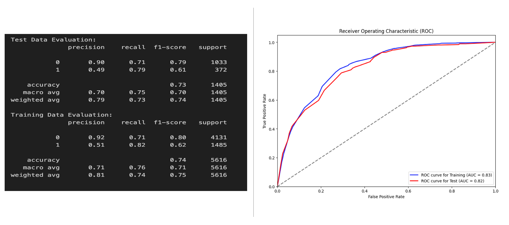

# Customer Churn Prediction

## Table of Contents

- [Project Overview](#project-overview)
- [Data Sources](#data-sources)
- [Results and Findings](#results-and-findings)
- [Recommendations](#recommendations)

### Project Overview
---

This program aims to create a classification model using the Scikit-Learn machine learning framework to accurately predict which customer groups (Customers) will stop subscribing or no longer buy products from a company. This model will help in understanding the concept of Churn rate, which is an indicator of whether a business is running well. Churn rate is a metric that describes the number of customers who cancel or do not renew their subscription with a company. So, the higher the churn rate, the more customers will stop buying from your business, which directly affects the revenue your business will receive. Based on this, building predictive models related to churn analysis becomes an important reference source for the sustainability of a business.

### Data Sources

The dataset used is data available on the Kaggle website, a dataset called *Telco Customer Churn* which contains information about transaction data and customer profiles from a telecommunications company domiciled in the United States. This data was obtained under license from the Kaggle website with the following [link](https://www.kaggle.com/datasets/blastchar/telco-customer-churn?datasetId=13996&sortBy=voteCount)

### Tools

- Python, Pandas, NumPy, Seaborn, Matplotlib - Data Analysis
- Scikit-Learn - Machine Learning
- Streamlit, Hugging Face - Model Deployment

### Data Preparation

In the initial data preparation phase, I performed the following tasks:
1. Data loading and inspection.
2. Removing Unnecessary Columns
3. Data cleaning and formatting.

### Exploratory Data Analysis

EDA involved exploring the data to answer key questions, such as:
- What percentage of customers are churning?
- Do churn patterns vary based on demographic information?
- What are the main drivers of customer dissatisfaction?
- Are there different patterns in customer churn depending on the type of service provided?
- Is there a variance in satisfaction levels among customers with different contract types?

### Feature Engineering

- Handling missing values
- Handling outliers using IQR Method 
- Scaling for numerical feautures
- Encoding for categorical features (OneHot & Ordinal) 
- Feature Selection (The statistical method used is Chi squared for categorical variable and ANOVA for numerical Variable) 

### Data Modeling

- In modelling phase, five algorithms were used to produce best classification model for predicting churn. 
- Then, Best model for each algorithm can be determined by using cross-validation during hyperparameter tuning with GridSearch or RandomizedSearch.
- After that, Evaluating the best model by showing all of the model evaluation metrics and scores, then Select Model with the Highest Recall & F1 Score. As previously explained, preventing churn is the company priority. This suggests that Recall might be the most appropriate metric to prioritize. By maximizing recall, the company ensures that it identifies the majority of customers who are at risk of churning, allowing for timely and effective interventions. However, maximizing recall without considering precision can also be costly. That's why monitoring F1 score is also essential to find the optimal balance.

### Results and Findings

The analysis results are summarized as follows:
1. The XGBoost model is performing consistently on both the training and test datasets, achieving a recall of around 82% for Class 1 (churn). 
2. The very close values of recall on both training and test indicate that the model is not overfitting. This means, in a real-world scenario, this model would be effective in helping to target around 80% of customers who are at risk of churning. 
3. So, Where the priority is to maximize the identification of potential churn cases, the XGBoost model would be the preferred choice for this churn prediction.

4. Based on The ROC AUC Curve, XGboost model providing high recall with an AUC of around 0.83 for training and 0.82 for testing is a good indication. 
5. These AUC values suggest that the model is performing well in distinguishing between the churn and not churn, despite the imbalance. When data classes are imbalanced, achieving a high recall and a good AUC can be challenging, This means The model can achieve high recall without sacrificing too much False Positive Rate, which is especially important in imbalanced datasets like churn prediction

### Recommendations

Based on the analysis, I recommend the following actions:
- Reassess Monthly Contracts: Investigate why monthly contracts have a higher churn rate
- Engage customers in feedback surveys, especially those on monthly contracts
- Evaluating the quality and pricing of their services, especially for Internet Fiber optic services 
- Examining the electronic check payment system for any issues

### Limitations

1. Addressing Data Imbalance: use undersampling techniques to balance the classes.
2. Hyperparameter Tuning: Further optimization efforts should be carried out to achieve higher recall and f-1 score. 
3. Add additional data or new Features: more data should be included in the analysis, like records of customer service interactions, Details about the customer's participation in loyalty or rewards programs, Feedback or survey responses from customers.

### References

1. [scikit-learn documentation](https://scikit-learn.org/stable/)
2. [Kaggle](https://www.kaggle.com/datasets/blastchar/telco-customer-churn)

